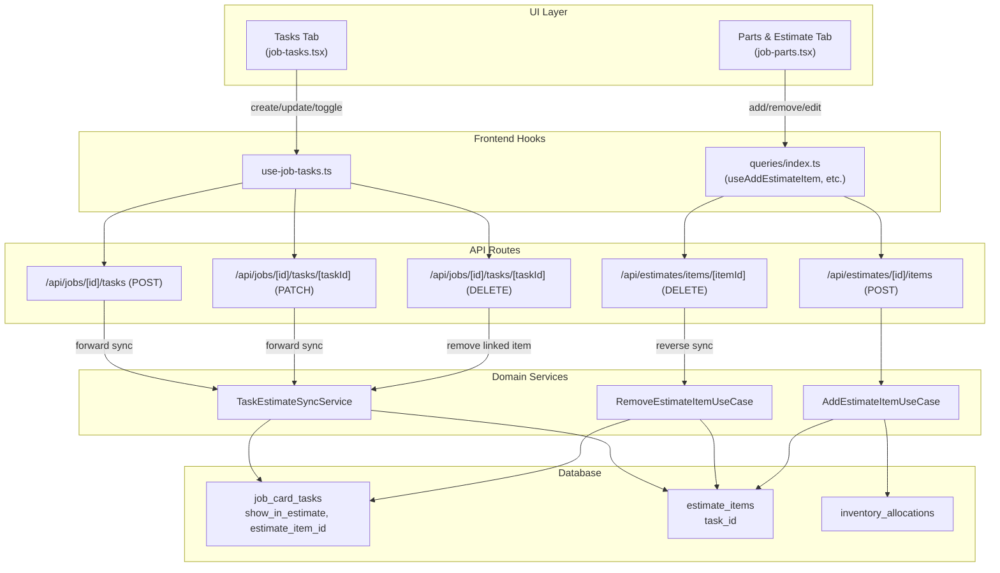
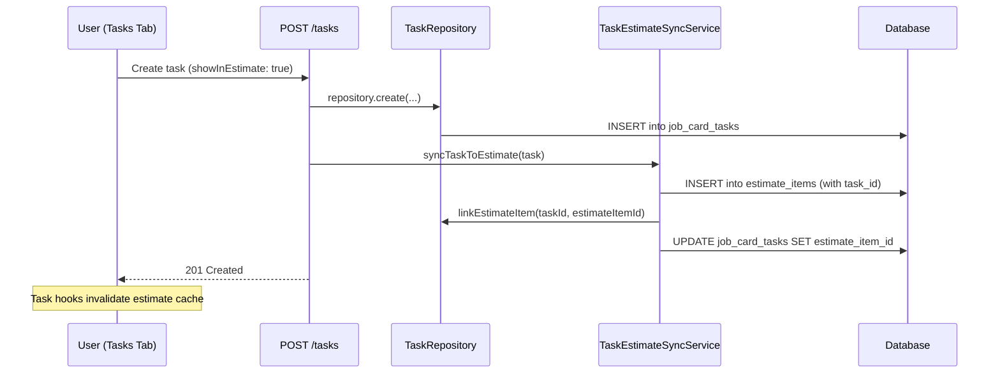
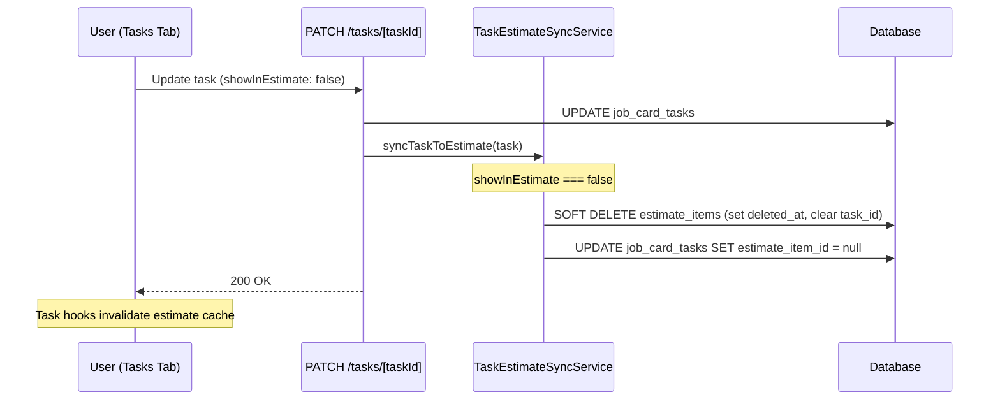
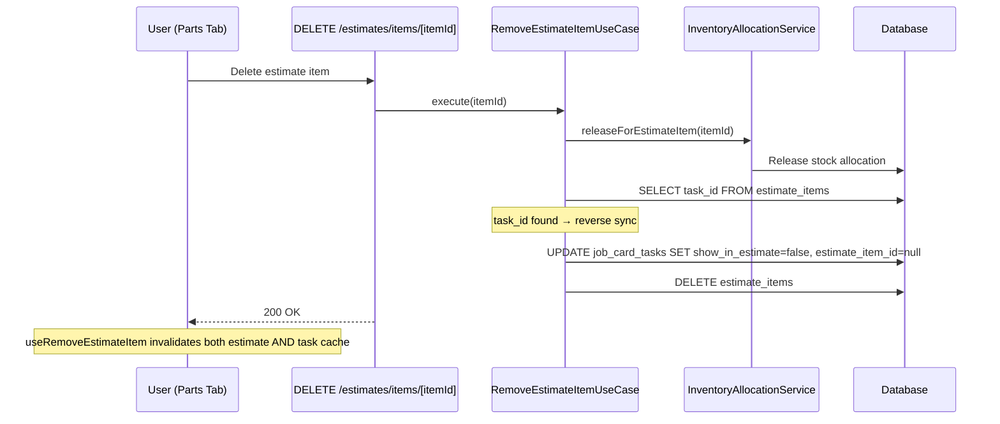
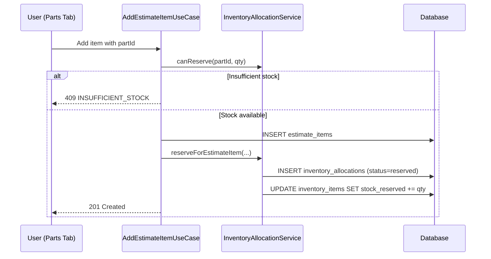
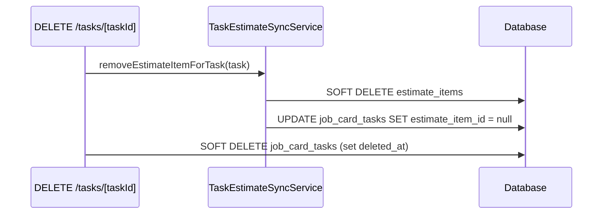

# Task ↔ Estimate System — Flow Documentation

## Architecture Overview



---

## Database Links

The bidirectional link between tasks and estimate items:

```
job_card_tasks                    estimate_items
┌─────────────────┐              ┌──────────────────┐
│ id               │◄────────────│ task_id           │
│ estimate_item_id │────────────►│ id                │
│ show_in_estimate │              │ part_id           │
│ ...              │              │ qty, unit_price   │
└─────────────────┘              └──────────────────┘
```

- `show_in_estimate` — controls whether the task syncs to an estimate item
- `estimate_item_id` — FK from task → its estimate item
- `task_id` — FK from estimate item → its source task (null for standalone items)

---

## Flow 1: Task Created → Estimate Item Auto-Created



**Files involved:**
- [tasks/route.ts](file:///c:/Users/sagun/OneDrive/Documents/GitHub/machnix/src/app/api/jobs/%5Bid%5D/tasks/route.ts) — lines 195-202
- [task-estimate-sync.service.ts](file:///c:/Users/sagun/OneDrive/Documents/GitHub/machnix/src/modules/job/application/task-estimate-sync.service.ts) — `syncTaskToEstimate()`

---

## Flow 2: Toggle `showInEstimate` OFF → Estimate Item Removed



**Files involved:**
- [tasks/[taskId]/route.ts](file:///c:/Users/sagun/OneDrive/Documents/GitHub/machnix/src/app/api/jobs/%5Bid%5D/tasks/%5BtaskId%5D/route.ts) — lines 233-239
- [task-estimate-sync.service.ts](file:///c:/Users/sagun/OneDrive/Documents/GitHub/machnix/src/modules/job/application/task-estimate-sync.service.ts) — lines 34-40

---

## Flow 3: Toggle `showInEstimate` ON → Estimate Item Re-Created

Same path as Flow 2 but `showInEstimate === true` → goes through the `createEstimateItem` branch in `syncTaskToEstimate()`.

---

## Flow 4: Estimate Item Deleted → Task Toggle OFF (Reverse Sync)



**Files involved:**
- [remove-estimate-item.use-case.ts](file:///c:/Users/sagun/OneDrive/Documents/GitHub/machnix/src/modules/estimate/application/remove-estimate-item.use-case.ts) — lines 42-65
- [items/[itemId]/route.ts](file:///c:/Users/sagun/OneDrive/Documents/GitHub/machnix/src/app/api/estimates/items/%5BitemId%5D/route.ts) — line 29
- [queries/index.ts](file:///c:/Users/sagun/OneDrive/Documents/GitHub/machnix/src/hooks/queries/index.ts) — `useRemoveEstimateItem` invalidates `["tasks", "job", jobId]`

---

## Flow 5: Add Inventory to Estimate → Stock Reserved



---

## Flow 6: Task Deleted → Estimate Item + Allocation Cleaned Up



---

## Standalone Estimate Items

Estimate items can exist **without** a linked task. These are added directly from the Parts & Estimate tab:
- `task_id = null` on the item
- No reverse sync needed on deletion
- Stock reservation still applies if `part_id` is set

---

## UI Components

| Component | Location | Purpose | Status |
|-----------|----------|---------|--------|
| **Tasks Tab** | [job-tasks.tsx](file:///c:/Users/sagun/OneDrive/Documents/GitHub/machnix/src/components/tenant/jobs/job-tasks.tsx) | Add/edit/delete tasks, inline toggle | ✅ Functional |
| **Task Modal** | [task-modal.tsx](file:///c:/Users/sagun/OneDrive/Documents/GitHub/machnix/src/components/tenant/jobs/task-modal.tsx) | Create/edit task with "Show in Estimate" toggle | ✅ Functional |
| **Parts & Estimate Tab** | [job-parts.tsx](file:///c:/Users/sagun/OneDrive/Documents/GitHub/machnix/src/components/tenant/jobs/job-parts.tsx) | Add/edit/remove estimate items, inventory search | ✅ Functional |
| **Job Details Dialog** | [job-details-dialog.tsx](file:///c:/Users/sagun/OneDrive/Documents/GitHub/machnix/src/components/tenant/jobs/job-details-dialog.tsx) | Tabs: Overview, Tasks, Parts & Estimate, Invoice | ✅ Functional |

---

## UI Gaps

> [!WARNING]
> The following UI features are **missing** from the current implementation:

### 1. No Task-Link Indicator on Estimate Items
Estimate items synced from tasks look identical to standalone items. Users can't tell which items came from tasks.

**Fix**: Show a badge/icon on estimate items with `task_id` (e.g., "From Task: Oil Filter Replacement").

### 2. No Protection for Task-Linked Items
Users can freely edit task-synced estimate items (qty, price, name) which will be overwritten next time the task is updated. This creates a confusing experience.

**Fix**: Make task-linked estimate items read-only in the Parts tab, with a hint like "Edit via Tasks tab". Or, stop syncing changes after first creation.

### 3. No Stock Reservation Status Display
When inventory is added to an estimate, stock is reserved in the background, but the UI doesn't show the reservation status or available stock.

**Fix**: Show a "Reserved" badge and available stock count alongside estimate items.

### 4. No "Consumed" Workflow
The `inventory_allocations` table supports `reserved` → `consumed` status transitions, but no UI or API triggers consumption when a job is completed.

**Fix**: When job status changes to `completed`, auto-consume all reserved allocations (decrement `stock_on_hand`, update allocation status to `consumed`).

### 5. No Batch Sync Trigger
If tasks exist before an estimate is created, there's no UI to trigger `syncAllTasksForJob()` to back-fill estimate items.

**Fix**: Auto-run `syncAllTasksForJob()` when an estimate is first created for a job that already has tasks.
