# Wrench Cloud - Data Flow Diagrams

This document describes how data flows through the Wrench Cloud system, from creation to destruction, including all transformations and state changes.

---

## System Overview

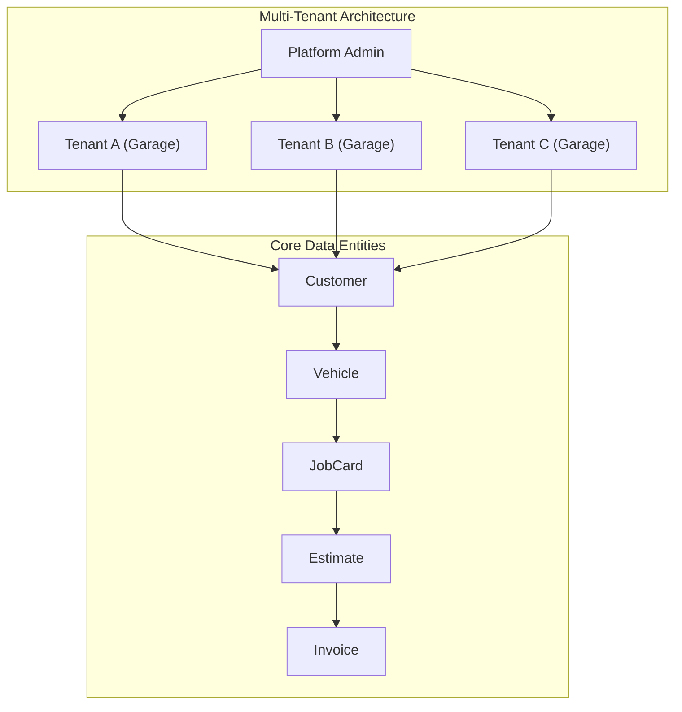

---

## Entity Relationship Diagram

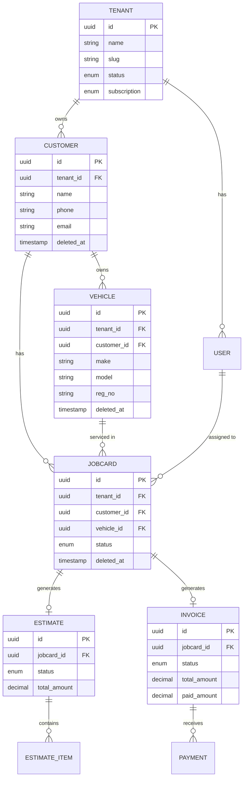

---

## 1. Tenant Lifecycle

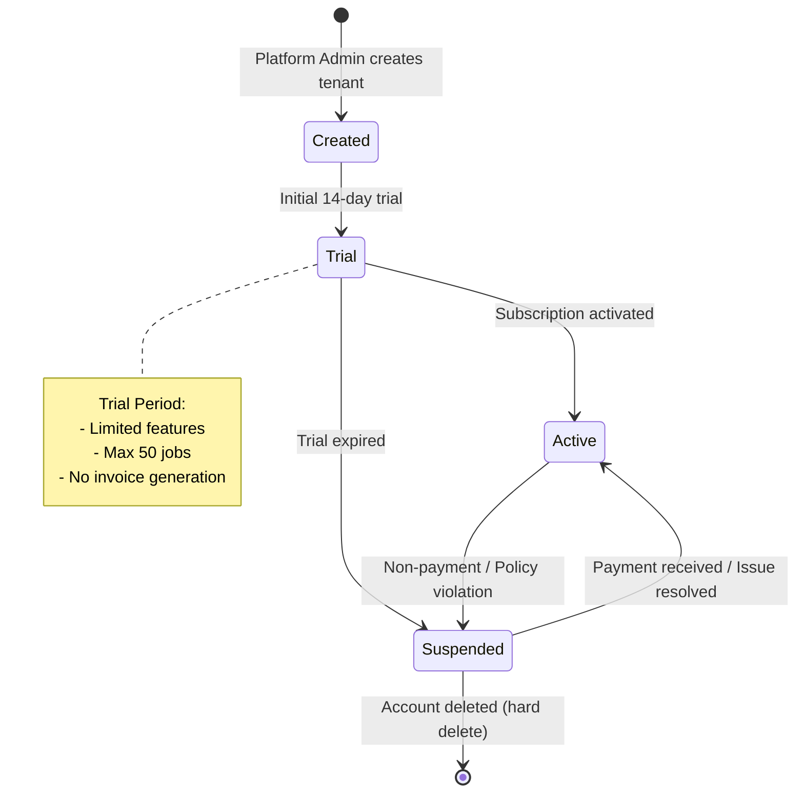

### Tenant Data Flow

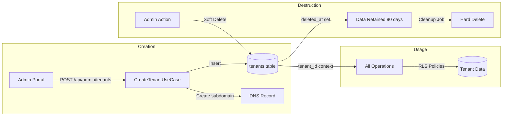

---

## 2. Customer Lifecycle

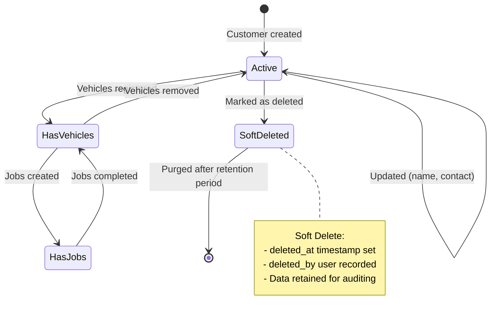

### Customer Data Flow

```mermaid
flowchart TB
    subgraph "Creation Phase"
        UI1[Add Customer Dialog] -->|Form Data| API1["/api/customers/create"]
        API1 -->|Validate| UC1[CreateCustomerUseCase]
        UC1 -->|Check duplicates| REPO1[CustomerRepository]
        REPO1 -->|Insert| DB1[(customers table)]
        DB1 -->|Return| RESP1[Customer Object]
    end
    
    subgraph "Read Phase"
        UI2[Customer List] -->|GET| API2["/api/customers"]
        API2 -->|Query with tenant_id| REPO2[GetAllCustomersUseCase]
        REPO2 -->|SELECT with joins| DB2[(customers + vehicles)]
        DB2 -->|Transform| VM1[CustomerWithStats ViewModel]
    end
    
    subgraph "Update Phase"
        UI3[Edit Dialog] -->|PUT| API3["/api/customers/{id}/update"]
        API3 -->|Validate| UC3[UpdateCustomerUseCase]
        UC3 -->|Check exists| REPO3[CustomerRepository]
        REPO3 -->|UPDATE| DB3[(customers table)]
        DB3 -->|updated_at = now| RESP3[Updated Customer]
    end
    
    subgraph "Deletion Phase"
        UI4[Delete Confirmation] -->|DELETE| API4["/api/customers/{id}/delete"]
        API4 -->|Soft Delete| UC4[DeleteCustomerUseCase]
        UC4 -->|Set deleted_at| REPO4[CustomerRepository]
        REPO4 -->|UPDATE| DB4[(customers table)]
    end
```

---

## 3. Vehicle Lifecycle

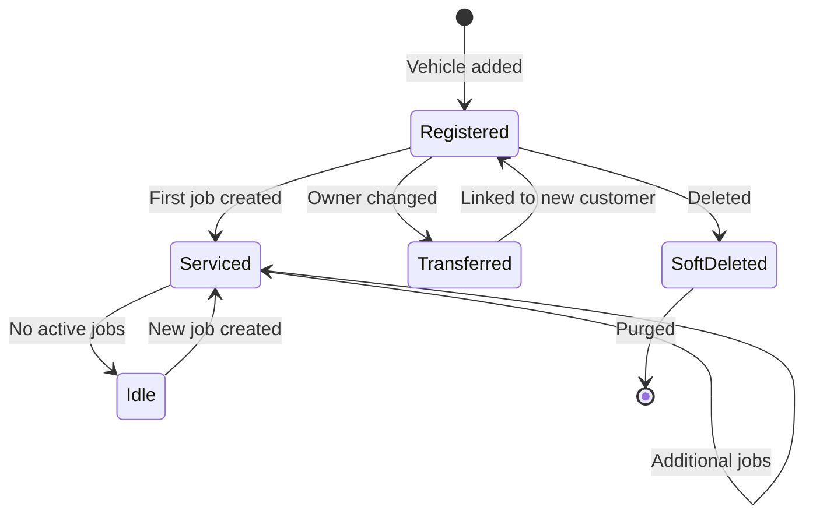

### Vehicle Data Flow

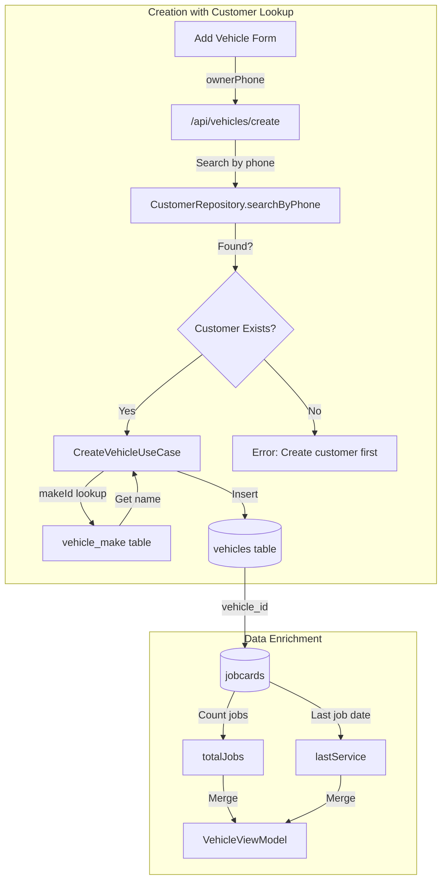

---

## 4. JobCard Lifecycle (Primary Business Flow)

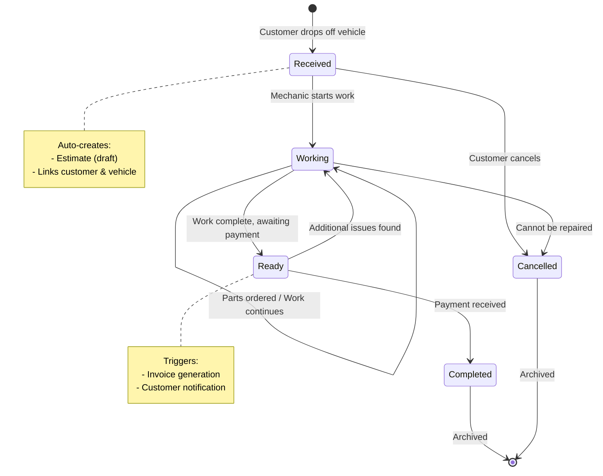

### JobCard Data Transformation Flow

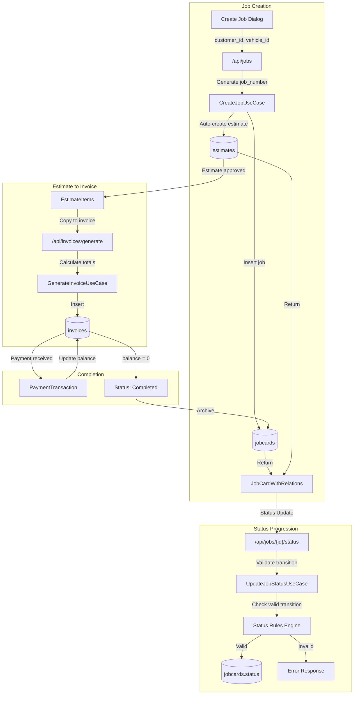

---

## 5. Estimate Lifecycle

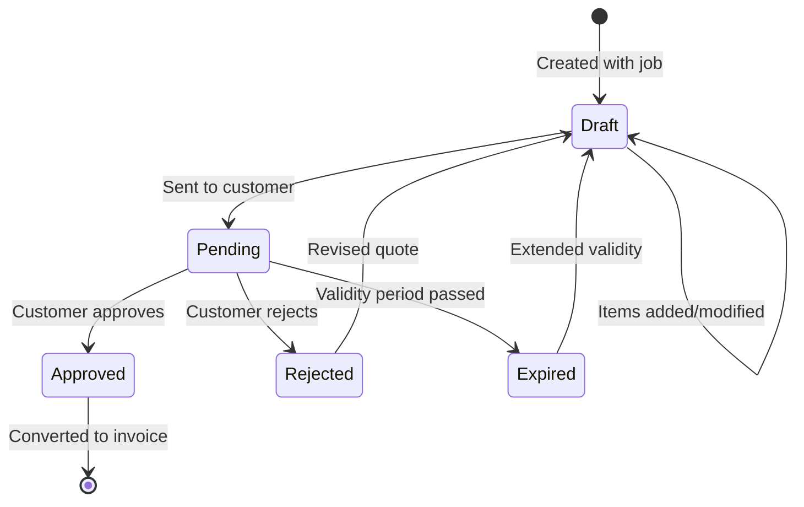

### Estimate Data Flow

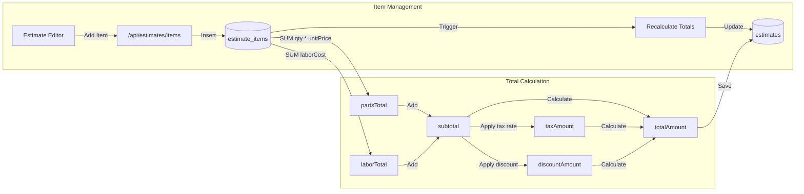

---

## 6. Invoice & Payment Lifecycle

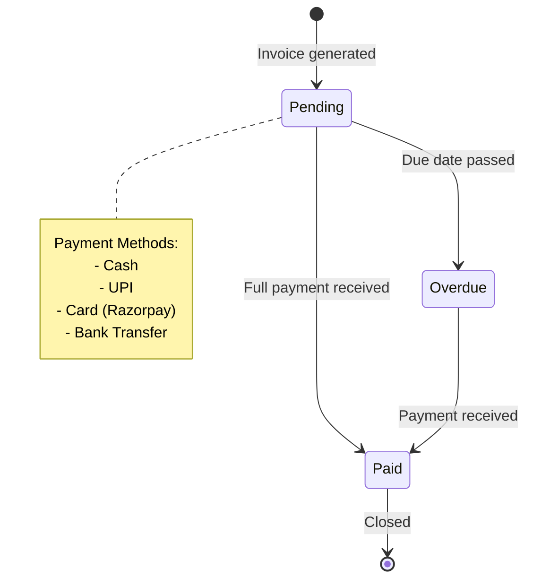

### Payment Data Flow

```mermaid
flowchart TB
    subgraph "Invoice Generation"
        EST[Approved Estimate] -->|Copy items| GEN[GenerateInvoiceUseCase]
        GEN -->|Calculate| INV[(invoices)]
        INV -->|invoice_number auto| NUM[INV-{tenant}-{seq}]
    end
    
    subgraph "Payment Processing"
        PAY1[Mark as Paid] -->|POST| API1["/api/invoices/{id}/pay"]
        API1 -->|Create transaction| TXN[(payment_transactions)]
        TXN -->|Update paid_amount| INV
        INV -->|Check balance| D1{balance = 0?}
        D1 -->|Yes| STATUS1[status: paid]
        D1 -->|No| STATUS2[status: pending]
    end
    
    subgraph "Razorpay Flow"
        RP1[Initiate Payment] -->|Create Order| API2[/api/payments/razorpay/order]
        API2 -->|razorpay_order_id| TXN
        RP2[Razorpay Callback] -->|Verify signature| API3[/api/payments/razorpay/verify]
        API3 -->|Update status| TXN
    end
```

---

## 7. Soft Delete Pattern

All entities follow a consistent soft-delete pattern for data integrity and audit trails:

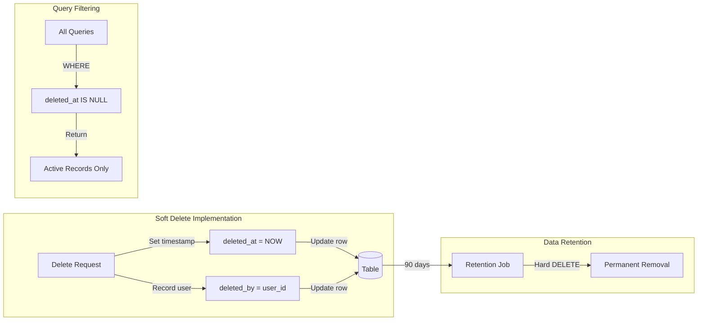

---

## 8. Data Transformation Layers

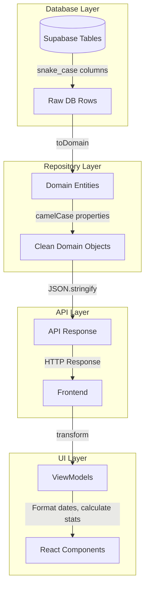

### Example: Vehicle Transformation Chain

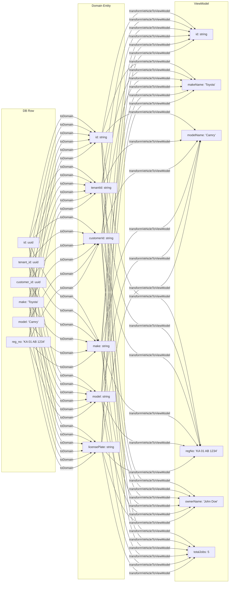

---

## Summary

| Entity | Create | Read | Update | Delete | States |
|--------|--------|------|--------|--------|--------|
| Tenant | Platform Admin | All Users | Platform Admin | Soft Delete | trial, active, suspended |
| Customer | Tenant User | Tenant Users | Tenant User | Soft Delete | active, deleted |
| Vehicle | Tenant User | Tenant Users | Tenant User | Soft Delete | registered, deleted |
| JobCard | Tenant User | Tenant Users | Tenant User | Soft Delete | received → completed |
| Estimate | Auto/Manual | Tenant Users | Tenant User | Soft Delete | draft → approved/rejected |
| Invoice | Auto | Tenant Users | System | Soft Delete | pending → paid |
