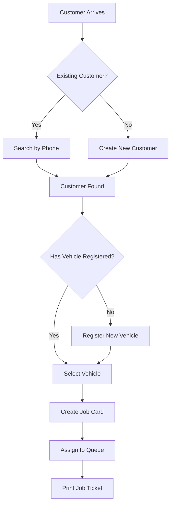
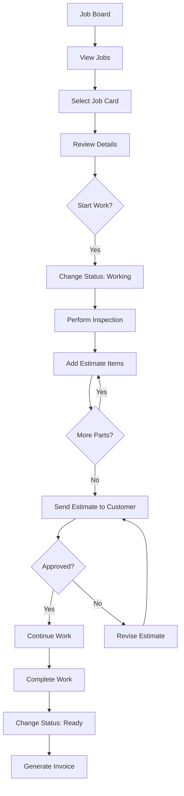
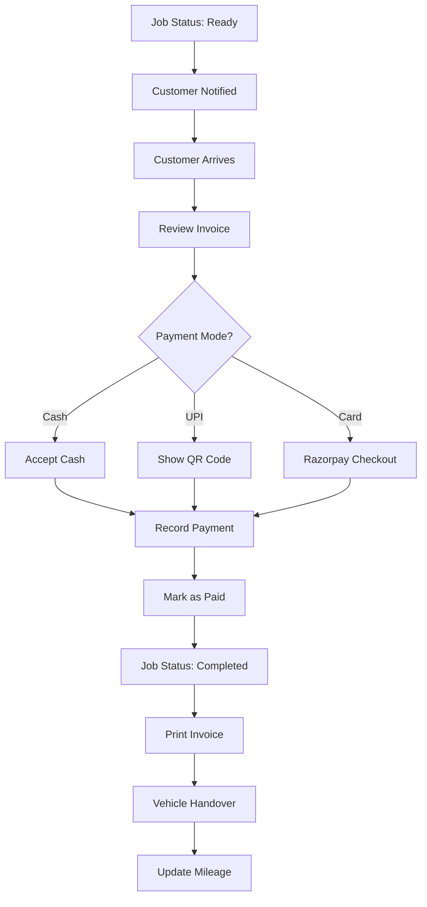
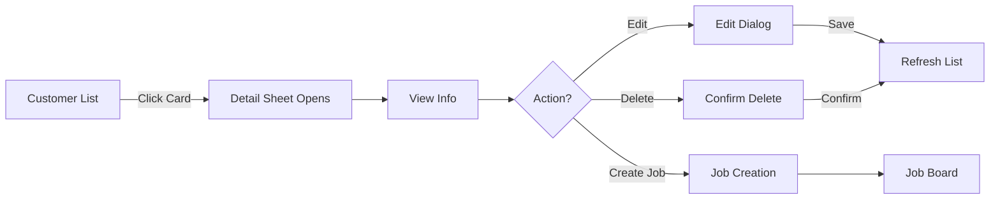
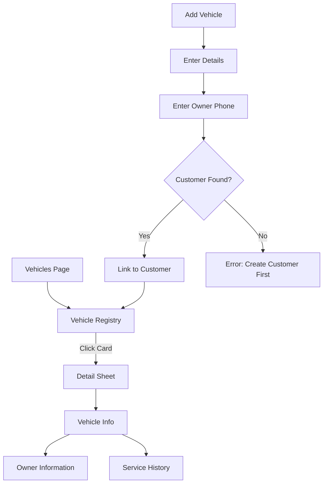
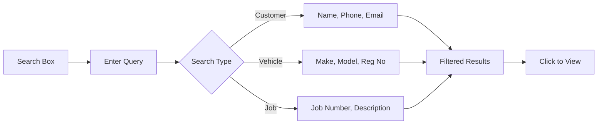

# Wrench Cloud - User Workflows (Part 1: Daily Operations)

This document covers the primary user workflows for daily garage operations.

---

## 1. Customer Check-In Workflow

**Actors:** Front Desk / Service Advisor

### Step-by-Step

1. **Customer Search**
   - Navigate to **Customers** page
   - Search by phone number or name
   - If not found, click **Add Customer**

2. **Customer Registration** (if new)
   - Fill in: Name (required), Phone, Email, Address
   - Click **Create Customer**

3. **Vehicle Selection/Registration**
   - View customer's registered vehicles
   - If new vehicle: Click **Add Vehicle**
   - Enter: Make, Model, Reg No., Owner Phone (for linking)

4. **Job Card Creation**
   - Click **Create Job** from customer or vehicle
   - Enter complaint/description
   - Assign mechanic (optional)
   - Job status starts as **Received**

---

## 2. Job Processing Workflow

**Actors:** Mechanic / Service Advisor

### Job Status Flow

| Status | Who Changes | Next Valid States |
|--------|-------------|------------------|
| Received | System (auto) | Working, Cancelled |
| Working | Mechanic | Ready, Cancelled |
| Ready | System/Advisor | Completed |
| Completed | System (auto) | - |
| Cancelled | Advisor | - |

### Estimate Management

1. **Add Parts/Labor**
   - Select from parts catalog or add custom item
   - Enter quantity and unit price
   - Add labor cost per item
   - System auto-calculates totals

2. **Send to Customer**
   - Click **Send Estimate**
   - Customer receives notification (future: WhatsApp/SMS)
   - Wait for approval

3. **Handling Approval**
   - Approved → Continue work
   - Rejected → Revise estimate

---

## 3. Payment & Delivery Workflow

**Actors:** Front Desk / Cashier

### Payment Methods

| Method | Process |
|--------|---------|
| Cash | Enter amount, click "Mark as Paid" |
| UPI | Generate QR, customer pays, mark paid |
| Card | Razorpay popup, auto-confirms |
| Bank Transfer | Record reference, mark paid |

---

## 4. Customer Detail View Workflow

### Available Actions

| Action | Description |
|--------|-------------|
| View Details | See full customer info, vehicles, job history |
| Edit Customer | Update name, phone, email, address |
| Create Job | Start new job for this customer |
| Delete | Soft-delete (can be recovered) |

---

## 5. Vehicle Management Workflow

### Vehicle Registration Requirements

| Field | Required | Notes |
|-------|----------|-------|
| Registration No. | ✅ | Must be unique |
| Make | ❌ | Select from dropdown |
| Model | ❌ | Free text |
| Year | ❌ | 1900-2030 |
| Color | ❌ | Free text |
| Odometer | ❌ | Current reading |
| Owner Phone | ✅ | Links to customer |

---

## 6. Search & Filter Workflow

### Search Shortcuts

| Page | Searchable Fields |
|------|------------------|
| Customers | Name, Phone, Email |
| Vehicles | Make, Model, Registration |
| Jobs | Job Number, Customer Name |

---

## Quick Reference Card

### Keyboard Shortcuts (Future)

| Shortcut | Action |
|----------|--------|
| `Ctrl+N` | New Customer |
| `Ctrl+J` | New Job |
| `Ctrl+F` | Focus Search |
| `Esc` | Close Dialog |

### Status Colors

| Color | Meaning |
|-------|---------|
| 🔵 Blue | Received (New) |
| 🟡 Amber | Working (In Progress) |
| 🟢 Green | Ready (Awaiting Payment) |
| ⚪ Gray | Completed |
| 🔴 Red | Cancelled |
