# Wrench Cloud - User Workflows (Part 2: Administration & System)

This document covers administrative workflows, system processes, and technical integrations.

---

## 1. Authentication Workflow

**Actors:** All Users

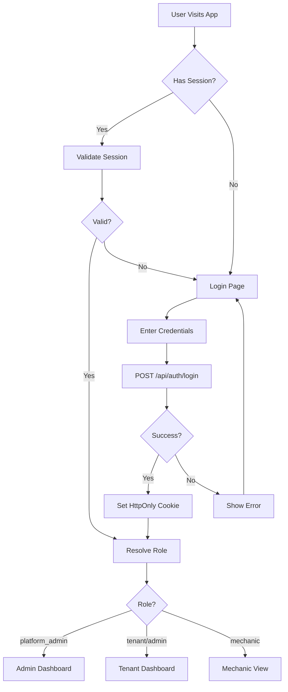

### Session Management

| Component | Description |
|-----------|-------------|
| `AuthProvider` | Client-side auth context |
| `/api/auth/login` | Server-side login (sets cookies) |
| `/api/auth/me` | Validate current session |
| `/api/auth/logout` | Clear session |

### Role-Based Routing

| Role | Default Route | Access |
|------|---------------|--------|
| `platform_admin` | `/admin/dashboard` | All tenants |
| `tenant` | `/dashboard` | Own tenant |
| `mechanic` | `/dashboard` | Limited view |

---

## 2. Tenant Onboarding Workflow

**Actors:** Platform Admin

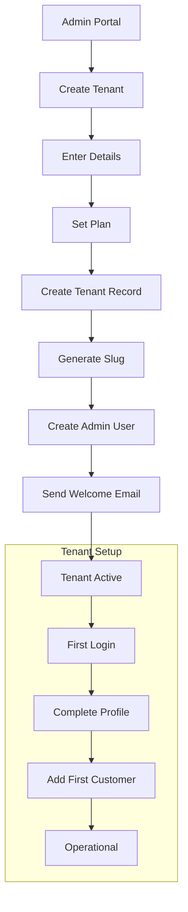

### Tenant Plans

| Plan | Features | Limits |
|------|----------|--------|
| Starter | Basic CRUD, 1 user | 100 jobs/month |
| Pro | + Reports, 5 users | 500 jobs/month |
| Enterprise | + API, Unlimited | Unlimited |

---

## 3. User Management Workflow

**Actors:** Tenant Admin

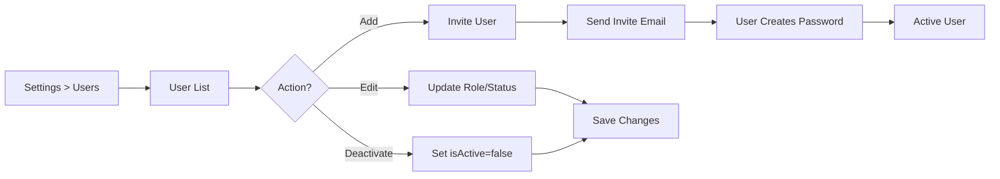

### User Roles in Tenant

| Role | Permissions |
|------|-------------|
| Admin | Full access, user management |
| Employee | CRUD operations, no settings |
| Mechanic | View assigned jobs, update status |

---

## 4. Impersonation Workflow (Platform Admin)

**Actors:** Platform Admin

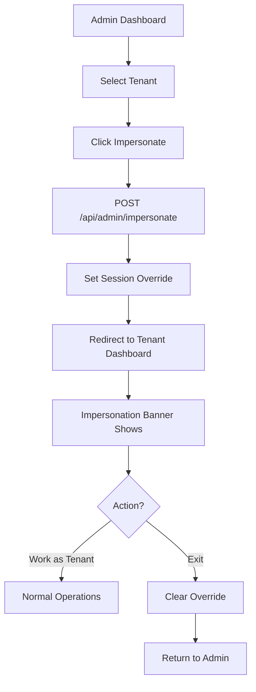

### Security Considerations

- Impersonation logged in audit trail
- Session expires after 1 hour
- Clear visual indicator of impersonation mode

---

## 5. Estimate-to-Invoice Workflow

**Actors:** System / Service Advisor

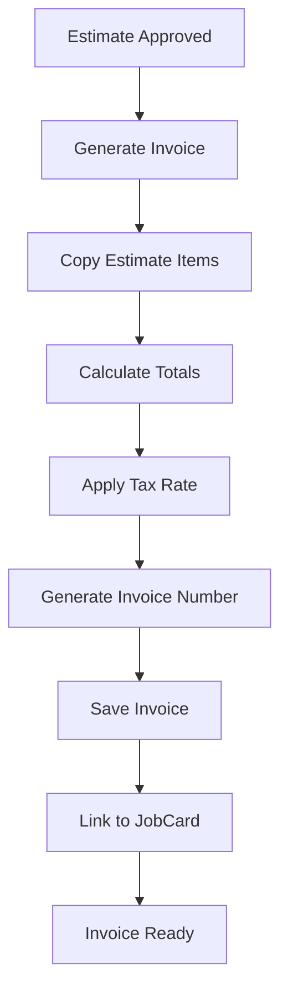

### Auto-Calculation Rules

```
partsTotal = SUM(item.qty × item.unitPrice)
laborTotal = SUM(item.laborCost)
subtotal = partsTotal + laborTotal
taxAmount = subtotal × taxRate
discountAmount = manual or percentage
totalAmount = subtotal + taxAmount - discountAmount
balance = totalAmount - paidAmount
```

---

## 6. Reporting Workflow

**Actors:** Tenant Admin / Owner

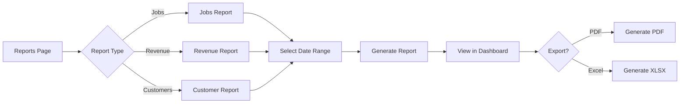

### Available Reports

| Report | Metrics |
|--------|---------|
| Jobs Summary | Total jobs, by status, avg completion time |
| Revenue | Total revenue, by payment method, trends |
| Customer Activity | New customers, repeat visits, vehicle count |

---

## 7. Notification Workflow

**Actors:** System

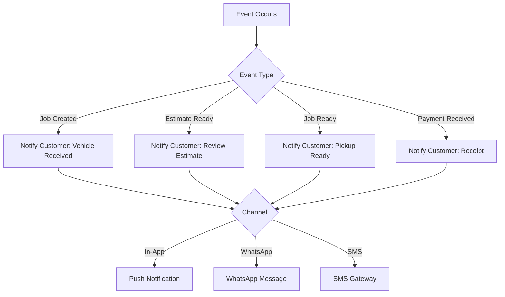

### Notification Templates

| Event | Message |
|-------|---------|
| Job Created | "Your vehicle has been checked in. Job #{number}" |
| Estimate Ready | "Your estimate is ready for review: ₹{amount}" |
| Job Ready | "Your vehicle is ready for pickup!" |
| Payment | "Payment received. Thank you!" |

---

## 8. Data Backup & Recovery Workflow

**Actors:** System / Platform Admin

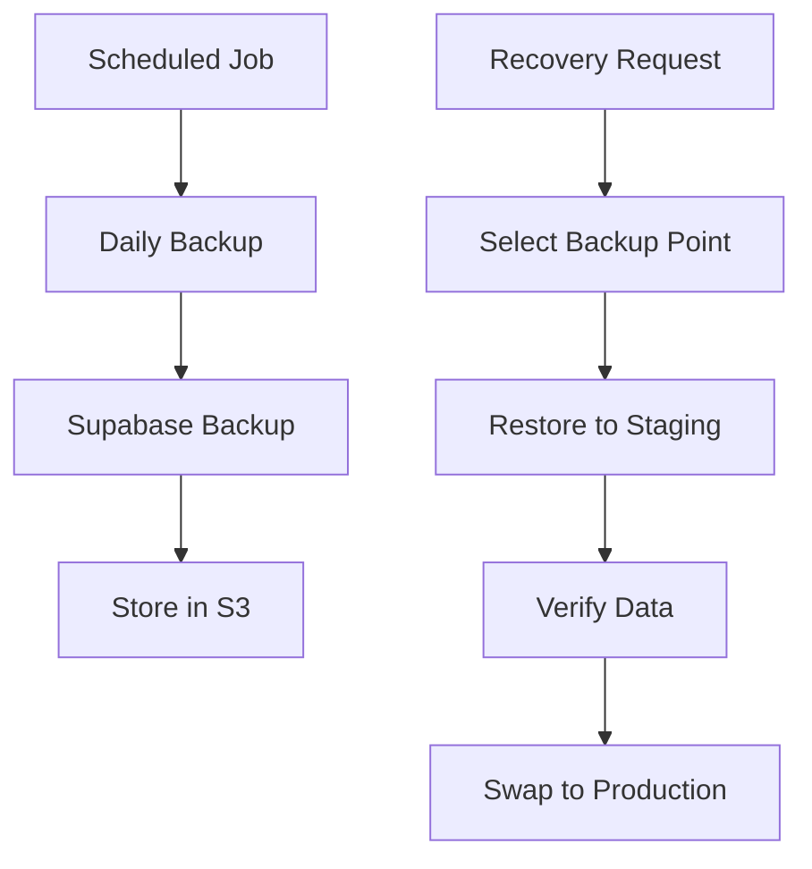

### Backup Schedule

| Type | Frequency | Retention |
|------|-----------|-----------|
| Full | Daily | 30 days |
| Incremental | Hourly | 7 days |
| Point-in-time | Continuous | 7 days |

---

## 9. API Integration Workflow

**Actors:** External Systems

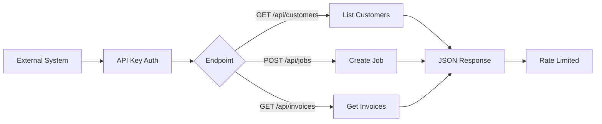

### API Rate Limits

| Tier | Requests/min | Burst |
|------|-------------|-------|
| Starter | 60 | 10 |
| Pro | 300 | 50 |
| Enterprise | 1000 | 200 |

---

## 10. Error Handling Workflow

**Actors:** System

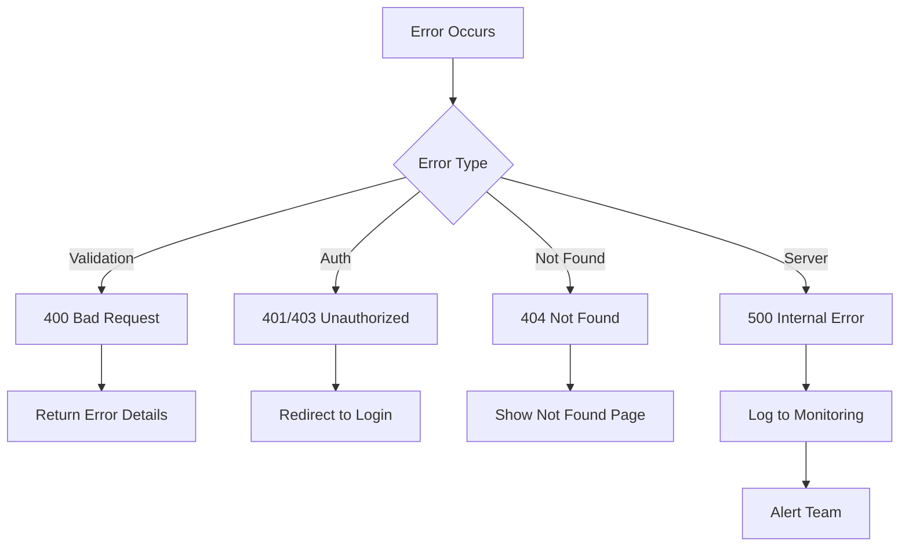

### Error Response Format

```json
{
  "error": "Validation failed",
  "details": [
    { "field": "email", "message": "Invalid email format" }
  ],
  "code": "VALIDATION_ERROR"
}
```

---

## Quick Reference: System Endpoints

### Authentication

| Endpoint | Method | Purpose |
|----------|--------|---------|
| `/api/auth/login` | POST | User login |
| `/api/auth/logout` | POST | User logout |
| `/api/auth/me` | GET | Current user |

### CRUD Entities

| Entity | List | Get | Create | Update | Delete |
|--------|------|-----|--------|--------|--------|
| Customers | GET / | GET /{id} | POST /create | PUT /{id}/update | DELETE /{id}/delete |
| Vehicles | GET / | GET /{id} | POST /create | PUT /{id}/update | DELETE /{id}/delete |
| Jobs | GET / | GET /{id} | POST / | PUT /{id} | DELETE /{id} |
| Estimates | GET / | GET /{id} | POST / | PUT /{id} | DELETE /{id} |
| Invoices | GET / | GET /{id} | POST /generate | PUT /pay | - |

---

## Integration Points

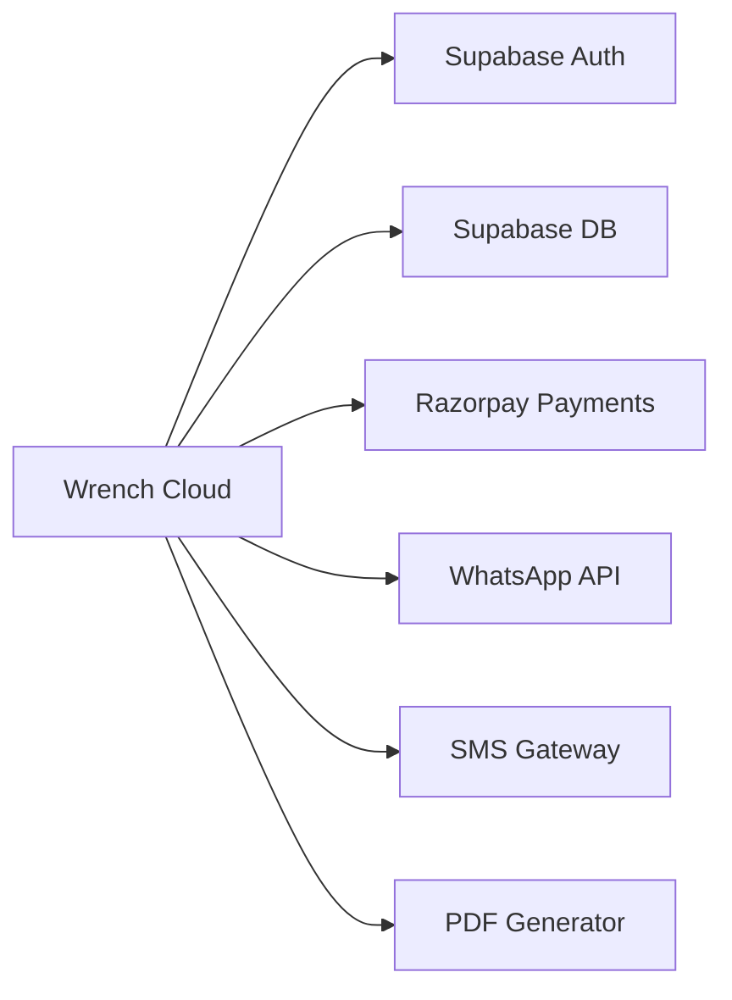

| Integration | Purpose | Status |
|-------------|---------|--------|
| Supabase | Auth + Database | ✅ Active |
| Razorpay | Payment Gateway | ✅ Active |
| WhatsApp | Notifications | 🔜 Planned |
| SMS | Notifications | 🔜 Planned |
